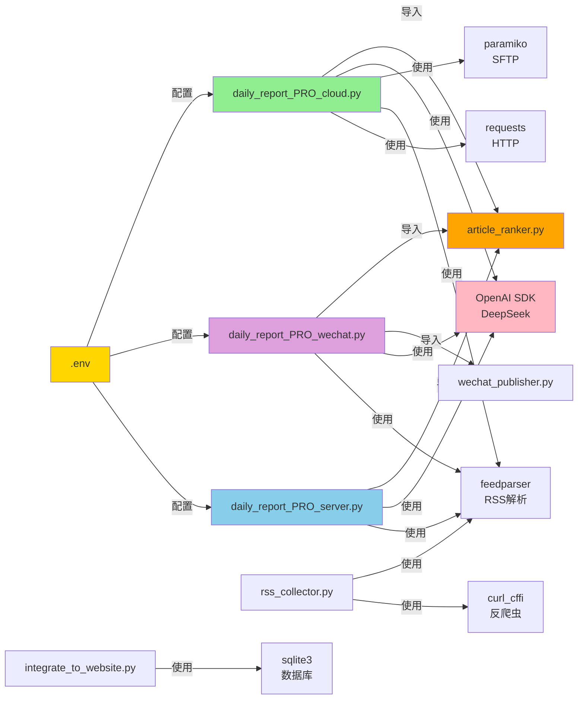
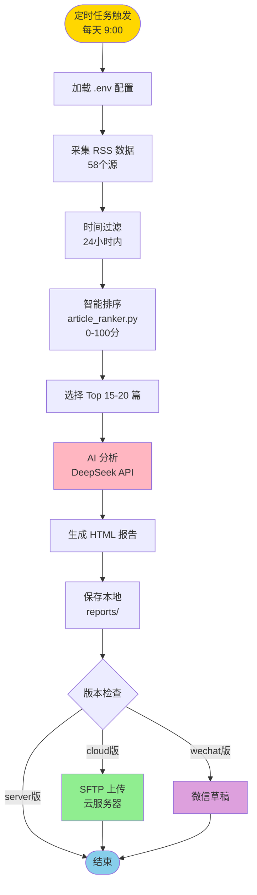
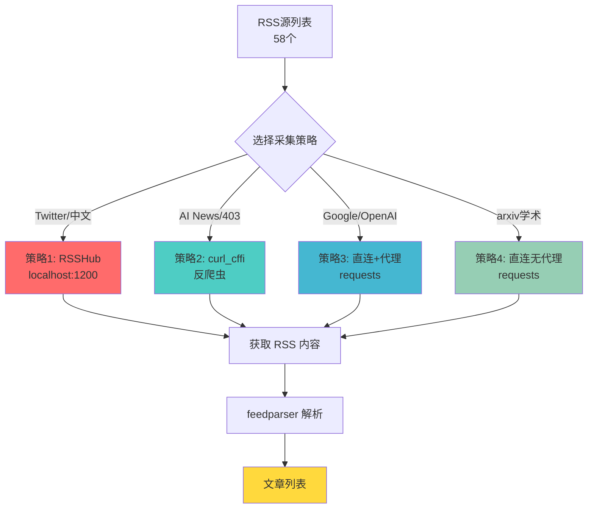
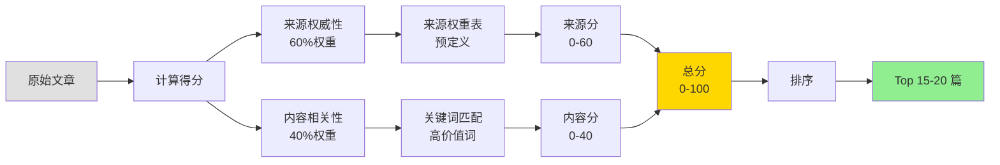
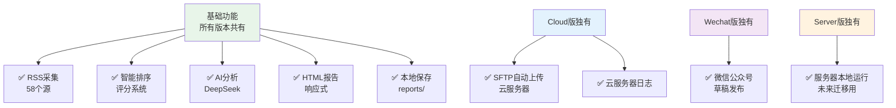
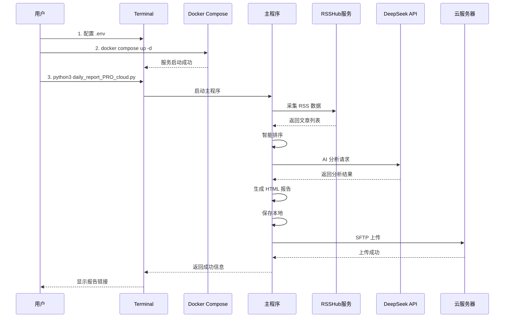
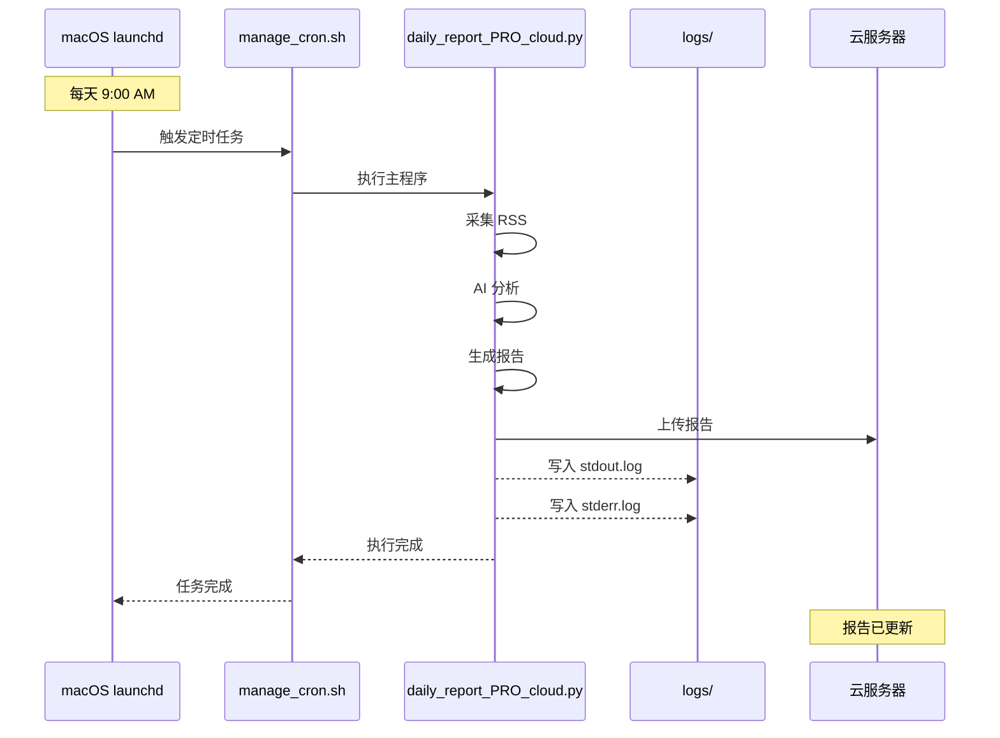
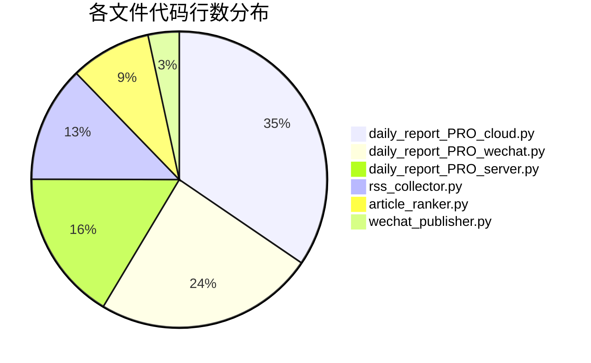
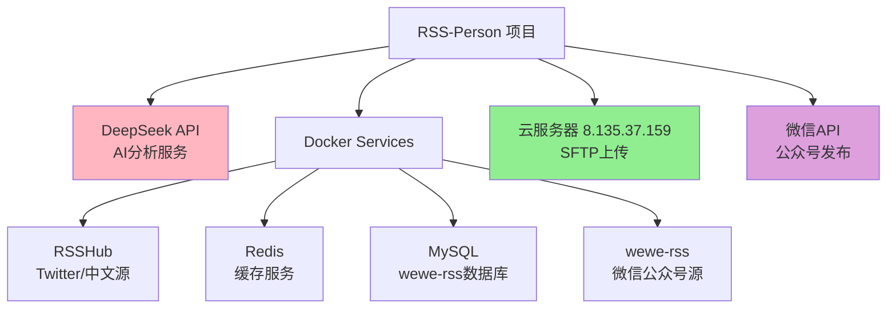

# RSS-Person 项目可视化流程图

## 主架构图详细依赖关系图

## 数据流向图

## RSS 采集策略图

## 文章排序评分流程

## 版本功能对比

## 启动和运行流程

## 定时任务自动运行流程

## 文件大小和复杂度可视化

## 外部服务依赖关系

---

## 如何查看这些流程图

1. **GitHub/GitLab**: 直接在 Markdown 文件中查看
2. **VS Code**: 安装 "Markdown Preview Mermaid Support" 插件
3. **在线工具**: 访问 https://mermaid.live/ 粘贴代码查看
4. **Typora**: 原生支持 Mermaid 图表
5. **Obsidian**: 原生支持 Mermaid 图表
